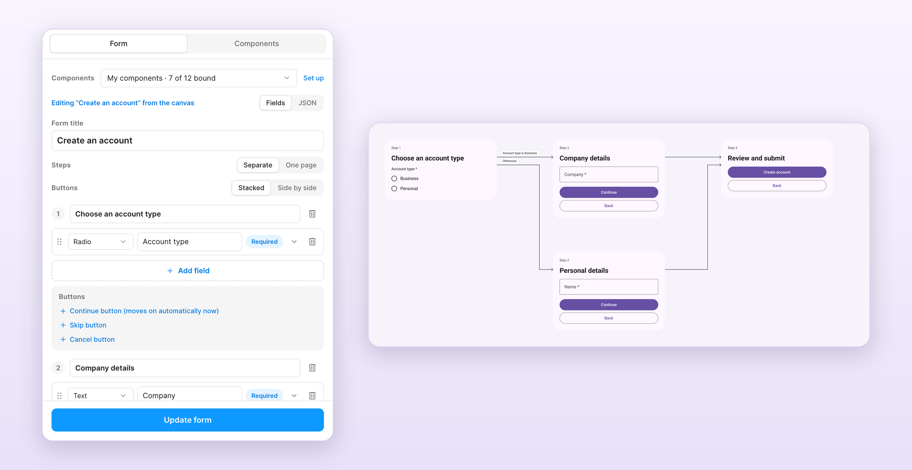
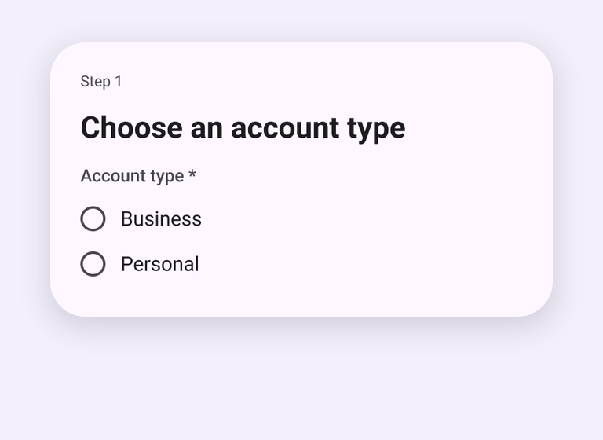

# Formhaus

[](https://www.npmjs.com/package/@formhaus/core)
[](https://www.npmjs.com/package/@formhaus/react)
[](https://www.npmjs.com/package/@formhaus/vue)
[](https://www.npmjs.com/package/@formhaus/mcp)
[](https://bundlejs.com/?q=@formhaus/core)
[](LICENSE)

Formhaus is a JSON form definition with a zero-dependency engine, React and Vue renderers, a Figma plugin, a JSON Schema and an MCP server for AI agents. One file describes fields, validation, conditional fields, multi-step navigation, branching routes and skippable steps.

**[Example](#example) · [Packages](#packages) · [Install](#install) · [Quick start](#quick-start) · [Custom components](#custom-components) · [Figma plugin](#figma-plugin) · [Docs](https://formhaus.dev) · [Spec](https://formhaus.dev/spec.html) · [Playground](https://formhaus.dev/playground.html)**

## What it's for

- [Multi-step forms with branching](https://formhaus.dev/guide/steps.html#route-between-branches) in React or Vue.
- [Rendering a form from JSON with your own components](https://formhaus.dev/guide/fields.html#override-default-components).
- [Designing the form in Figma](https://formhaus.dev/guide/figma.html) from the same file.
- Generating and checking definitions with AI agents: [Claude Code skills](https://formhaus.dev/guide/formhaus-create-form.html), the [MCP server](https://formhaus.dev/guide/mcp.html) (`claude plugin marketplace add ignsm/formhaus && claude plugin install formhaus@formhaus`), the [JSON Schema](https://formhaus.dev/api/definition.html#json-schema) and the [format specification](https://formhaus.dev/spec.html).
- A [headless engine](https://formhaus.dev/api/form-engine.html) for Svelte or vanilla JS.

## Example

Business accounts get a company step; everyone converges on review.

```json
{
  "$schema": "https://formhaus.dev/schema/form-definition.json",
  "id": "signup",
  "title": "Sign up",
  "submit": { "label": "Create account" },
  "steps": [
    {
      "id": "account",
      "title": "Account",
      "fields": [
        { "key": "email", "type": "email", "label": "Email", "validation": { "required": true } },
        { "key": "kind", "type": "radio", "label": "Account type", "autoAdvance": true,
          "options": [{ "value": "personal", "label": "Personal" }, { "value": "business", "label": "Business" }] }
      ],
      "routes": [
        { "to": "company", "show": [{ "field": "kind", "eq": "business" }] },
        { "to": "review" }
      ]
    },
    { "id": "company", "title": "Company", "routes": [{ "to": "review" }],
      "fields": [{ "key": "company", "type": "text", "label": "Company name", "validation": { "required": true } }] },
    { "id": "review", "title": "Review",
      "fields": [{ "key": "terms", "type": "checkbox", "label": "I accept the terms", "validation": { "required": true } }] }
  ]
}
```

```tsx
import { FormRenderer } from '@formhaus/react';
import definition from './signup.json';

<FormRenderer definition={definition} onSubmit={save} />;
```

[Compare with react-hook-form, TanStack Form, react-jsonschema-form and SurveyJS →](https://formhaus.dev/compare/)

## Packages

| Package | Description | npm |
|---------|-------------|-----|
| `@formhaus/core` | Zero-dependency form engine: types, validation, visibility, multi-step | `npm i @formhaus/core` |
| `@formhaus/react` | React adapter with native HTML defaults and custom component support | `npm i @formhaus/react` |
| `@formhaus/vue` | Vue 3 adapter with native HTML defaults and custom component support | `npm i @formhaus/vue` |
| `@formhaus/mcp` | MCP server: validate definitions and simulate paths from AI agents | `claude mcp add formhaus -- npx -y @formhaus/mcp` |

`@formhaus/figma` generates form mockups on the Figma canvas. It is not on Figma Community yet; build it locally, then import `packages/figma/manifest.json`.

Svelte, Solid, or anything else: use `@formhaus/core` directly. The [playground](https://formhaus.dev/playground.html) has a Svelte example.

## Install

```bash
npm install @formhaus/core
```

If you need a framework adapter:

```bash
npm install @formhaus/react   # React
npm install @formhaus/vue     # Vue
```

Or use `@formhaus/core` directly with any framework. See the [Svelte example](https://formhaus.dev/playground.html).

## Quick start

### Define a form

Write the JSON by hand, or use the [`/formhaus:formhaus-create-form`](https://formhaus.dev/guide/formhaus-create-form.html) Claude Code skill to generate it from a text description, a CSV table, or a screenshot of an existing form.

```json
{
  "$schema": "https://formhaus.dev/schema/form-definition.json",
  "id": "contact",
  "title": "Contact Us",
  "submit": { "label": "Send" },
  "fields": [
    {
      "key": "name",
      "type": "text",
      "label": "Name",
      "placeholder": "Your name",
      "validation": { "required": true, "minLength": 2 }
    },
    {
      "key": "email",
      "type": "email",
      "label": "Email",
      "placeholder": "you@example.com",
      "validation": {
        "required": true,
        "pattern": "^[^\\s@]+@[^\\s@]+\\.[^\\s@]+$",
        "patternMessage": "Please enter a valid email address"
      }
    },
    {
      "key": "message",
      "type": "textarea",
      "label": "Message",
      "placeholder": "How can we help?",
      "rows": 4,
      "validation": { "required": true }
    }
  ]
}
```

### React

```bash
npm install @formhaus/core @formhaus/react
```

```tsx
import { FormRenderer } from '@formhaus/react';
import definition from './contact-form.json';

function ContactPage() {
  async function handleSubmit(values: Record<string, unknown>) {
    await fetch('/api/contact', {
      method: 'POST',
      body: JSON.stringify(values),
    });
  }

  return <FormRenderer definition={definition} onSubmit={handleSubmit} />;
}
```

### Vue

```bash
npm install @formhaus/core @formhaus/vue
```

```vue
<script setup lang="ts">
import { FormRenderer } from '@formhaus/vue';
import definition from './contact-form.json';

async function handleSubmit(values: Record<string, unknown>) {
  await fetch('/api/contact', {
    method: 'POST',
    body: JSON.stringify(values),
  });
}
</script>

<template>
  <FormRenderer :definition="definition" @submit="handleSubmit" />
</template>
```

By default, both adapters render native HTML inputs. A step can hide Next with `next: false`, and cancellable async hooks run before and after navigation and submission. See [lifecycle hooks](https://formhaus.dev/guide/steps.html#lifecycle-hooks).

## Custom components

Both adapters accept a `components` prop (a `FieldComponentMap`) that lets you swap native HTML inputs for your own UI kit.

<details>
<summary><b>React</b></summary>

```tsx
import type { FieldComponentMap, FieldComponentProps } from '@formhaus/react';

function MyTextInput({ field, value, error, onChange, onBlur }: FieldComponentProps) {
  return (
    <div>
      <label>{field.label}</label>
      <input
        type={field.type}
        value={(value as string) ?? ''}
        placeholder={field.placeholder}
        onChange={(e) => onChange(e.target.value)}
        onBlur={onBlur}
      />
      {error && <span className="error">{error}</span>}
    </div>
  );
}

const components: FieldComponentMap = {
  text: MyTextInput,
  email: MyTextInput,
};

<FormRenderer definition={definition} onSubmit={handleSubmit} components={components} />;
```

</details>

<details>
<summary><b>Vue</b></summary>

```vue
<!-- MyTextInput.vue -->
<script setup lang="ts">
import type { FormFieldProps } from '@formhaus/vue';

const props = defineProps<FormFieldProps>();
const emit = defineEmits<{ (e: 'update:value', value: unknown): void }>();
</script>

<template>
  <label>{{ props.field.label }}</label>
  <input
    :value="(props.value as string) ?? ''"
    @input="emit('update:value', ($event.target as HTMLInputElement).value)"
  />
</template>
```

```vue
<!-- Usage -->
<script setup>
import { FormRenderer } from '@formhaus/vue';
import MyTextInput from './MyTextInput.vue';
</script>

<template>
  <FormRenderer
    :definition="definition"
    :components="{ text: MyTextInput, email: MyTextInput }"
    @submit="handleSubmit"
  />
</template>
```

</details>

Each field component receives the full `FormField` descriptor, the current value, and any validation error. Implement as many or as few field types as you need. Unmapped types fall back to native HTML.

## Figma plugin

`@formhaus/figma` renders form definitions in Figma with built-in Material 3 and iOS-like kits or with your own components. Branching forms get a flow map, multi-step forms a clickable prototype, and a generated form can be selected, edited and updated in place.





The [`/formhaus:formhaus-figma-connect`](https://formhaus.dev/guide/formhaus-figma-connect.html) Claude Code skill binds your library's components to the plugin. See the [plugin guide](https://formhaus.dev/guide/figma.html) for local installation.

## Contributing

See [CONTRIBUTING.md](CONTRIBUTING.md).

## License

[MIT](LICENSE)
