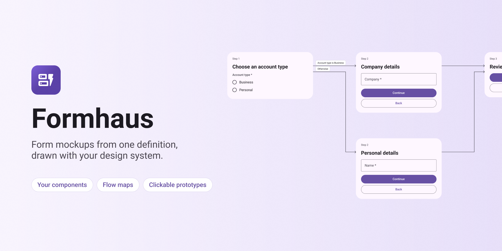

# Figma Community listing

## Name

Formhaus

## Tagline

Form mockups from one definition, drawn with your design system.

## Description

Formhaus draws forms as real component instances: text fields, selects, dates, file uploads, checkboxes, radios, switches and buttons.

- Bind your own components once, or use the built-in Material 3 or iOS-like kit.
- Build a form in the editor or paste a Formhaus JSON definition.
- Multi-step forms get one frame per step, or one page with sections.
- Forms with routes get a flow map with labelled arrows.
- Every multi-step form is a clickable prototype: Continue, Back, Skip and branching answers lead to the right step.
- Select a generated form to edit it and update it in place.
- Save your bindings as a design system and share it with a setup code.

The same definition renders in React and Vue with `@formhaus/core`, so the mockup and the shipped form stay in sync.

Docs: https://formhaus.dev/guide/figma.html

## Tags

forms, form builder, design system, components, prototype, flow, wizard, onboarding, survey, quiz, material, ios

## Support

https://github.com/ignsm/formhaus/issues

## Data and network

- No network access. The manifest declares `allowedDomains: ["none"]`.
- Form definitions, layouts and bindings are stored in the Figma file as shared plugin data under the `formhaus` namespace.
- Saved design systems are stored in the plugin's client storage on the user's machine.

## Publishing checklist

1. Publish from Figma desktop: **Plugins → Development → Formhaus → Publish**. Figma assigns a numeric plugin id; replace `"id": "formhaus"` in `manifest.json` with it and commit.
2. Upload `community/icon.png` (128×128) and `community/cover.png` (1920×960). Add `docs/public/figma/prototype.gif`, `flow-map.png`, `components.png` and `one-page.png` as carousel images.
3. Paste the tagline, description and tags above.
4. Set the support contact to the issues link.
5. Before publishing, run the plugin from a clean build (`pnpm --filter @formhaus/figma build`) in a new file: generate the example forms with a built-in kit, bind a few components, update a form, play the prototype.
